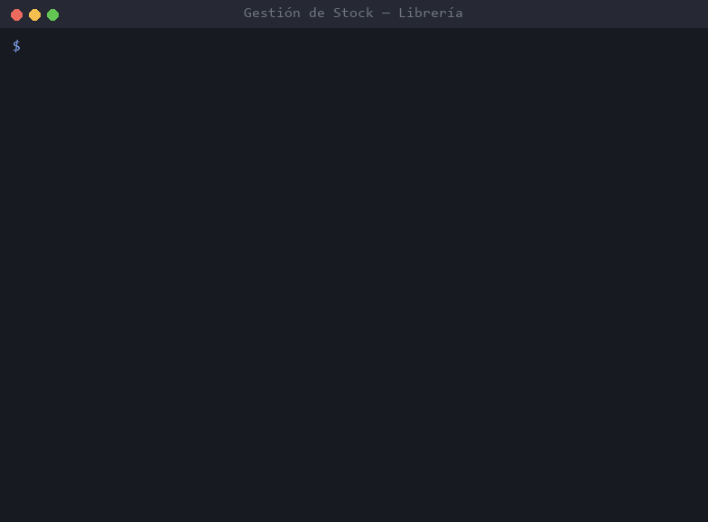

# Gestión de Stock para Librería

App de consola en Java para llevar el stock de una librería. Cada usuario tiene su cuenta y su propio inventario de libros, que queda guardado en un archivo de texto.

## Problema que resuelve

Una librería chica que anota el stock en papel o en una planilla suelta no sabe rápido cuántos ejemplares le quedan de un título, y las correcciones se pierden o se pisan. Hice una herramienta mínima para cargar, corregir, dar de baja y consultar libros desde la terminal, con una cuenta por usuario para que cada uno maneje su inventario.

La empecé en el curso de Java inicial de Codo a Codo y después la retomé para ordenarla y dejarla terminada. El proyecto está cerrado: no tiene más desarrollo previsto.

## Demo



Creo un usuario, inicio sesión, cargo dos libros, los listo, cambio la cantidad de uno, elimino el otro y salgo. Después vuelvo a abrir el programa: el libro sigue ahí porque quedó guardado en `datos.txt`.

## Tecnologías

- **Java 17+**, solo con la biblioteca estándar (sin dependencias ni herramientas de build).
- **`java.nio.file`** para leer y escribir el archivo de datos.

## Cómo funciona

| Archivo | Qué hace |
|---|---|
| [`App`](src/logica/App.java) | Punto de entrada. Menú inicial, alta de usuarios e inicio de sesión. |
| [`GestionStock`](src/logica/GestionStock.java) | Menú de stock del usuario que inició sesión: alta, modificación, baja y listado de libros. |
| [`Menu`](src/logica/Menu.java) | Texto de los menús y número de cada opción. |
| [`Consola`](src/logica/Consola.java) | Todo lo que se lee del teclado y se muestra en pantalla. |
| [`RegistroUsuarios`](src/logica/RegistroUsuarios.java) | Lista de usuarios y guardado/lectura de `datos.txt`. |
| [`Usuario`](src/logica/Usuario.java), [`Producto`](src/logica/Producto.java) | Los datos: un usuario tiene una lista de productos (libros). |

Decisiones que tomé y por qué:

- **Cada usuario es dueño de su lista de libros.** Es la forma más directa de que cada cuenta vea solo su inventario, sin tablas ni identificadores que relacionen una cosa con otra. La contra es que dos usuarios no pueden compartir stock.
- **Los datos se guardan en un `.txt` que se puede leer con el Bloc de notas.** Quería poder abrir el archivo y entender qué hay sin otra herramienta. Hay una línea por registro, con los campos separados por tabulación: una coma o un punto y coma aparecen seguido en títulos, una tabulación casi nunca. Cada línea `PRODUCTO` pertenece al último `USUARIO` que aparece arriba, así no repito el nombre en cada libro:
  ```
  USUARIO     sol     1234
  PRODUCTO    978-1   Rayuela   Julio Cortázar   Alfaguara   8
  ```
- **El archivo se reescribe completo en cada cambio.** Con pocos datos es instantáneo, y el archivo nunca queda con una parte actualizada y otra vieja.
- **Si el archivo está dañado, la app avisa y no arranca.** Si arrancara con la lista vacía, el primer guardado borraría los datos que no pudo leer. Prefiero que se corrija la línea a mano.
- **Toda la entrada por teclado pasa por `Consola`.** En la primera versión, escribir una letra donde se esperaba un número cortaba el programa. Ahora los menús lo toman como una opción inválida y los campos numéricos vuelven a preguntar.
- **Los menús son bucles, no llamadas recursivas.** Antes cada menú volvía a mostrarse llamándose a sí mismo: funcionaba, pero cada acción sumaba una llamada más a la pila.
- **`switch` con flechas (`->`).** En la primera versión faltaban `break` en "Modificar", y al cambiar el autor el programa seguía pidiendo la editorial y la cantidad. Con `->` no hay caída de un caso al siguiente, así que ese error no puede volver a pasar.

## Cómo correrlo

Necesitás el JDK 17 o superior.

```
git clone https://github.com/solalcaraz/Gestion_Stock_Libreria-CAC.git
cd Gestion_Stock_Libreria-CAC
javac -encoding UTF-8 -d out src/logica/*.java
java -cp out logica.App
```

Los datos se guardan en `datos.txt`, en la carpeta desde donde ejecutes el programa. Para empezar de cero, borrá ese archivo. En Windows, si los acentos se ven mal en la consola, ejecutá `chcp 65001` antes de correrlo.

## Qué aprendí y qué mejoraría

**Aprendí:**

- A separar responsabilidades. La primera versión tenía casi todo en una clase de 300 líneas que mezclaba menús, validaciones y datos. Ahora cada clase hace una sola cosa y se lee en una pantalla.
- Que un refactor hay que verificarlo. En un commit moví los menús a otra clase y nunca los llamé, así que el programa arrancaba en una pantalla vacía. Para ordenar el proyecto grabé la salida de la versión original con entradas fijas y la comparé con la nueva, hasta que coincidieron (salvo los acentos y el bug corregido).
- A leer la entrada del usuario siempre como texto y validarla, en vez de confiar en que escriba lo que se espera.

**Mejoraría:**

- **Contraseñas:** se guardan en texto plano en `datos.txt`. En algo real guardaría un hash con sal (por ejemplo PBKDF2) y nunca la contraseña.
- **Códigos repetidos:** hoy se pueden cargar dos libros con el mismo código. Lo validaría al cargar.
- **Listado vacío:** si no hay libros, no muestra nada. Un mensaje como "No hay productos cargados" sería más claro.
- **Tests:** agregaría pruebas con JUnit para `RegistroUsuarios` (guardar, volver a leer, archivo dañado) y para la búsqueda de productos.
- **Tabulaciones:** una tabulación escrita dentro de un campo rompería el formato del archivo. La reemplazaría al leer la entrada.
